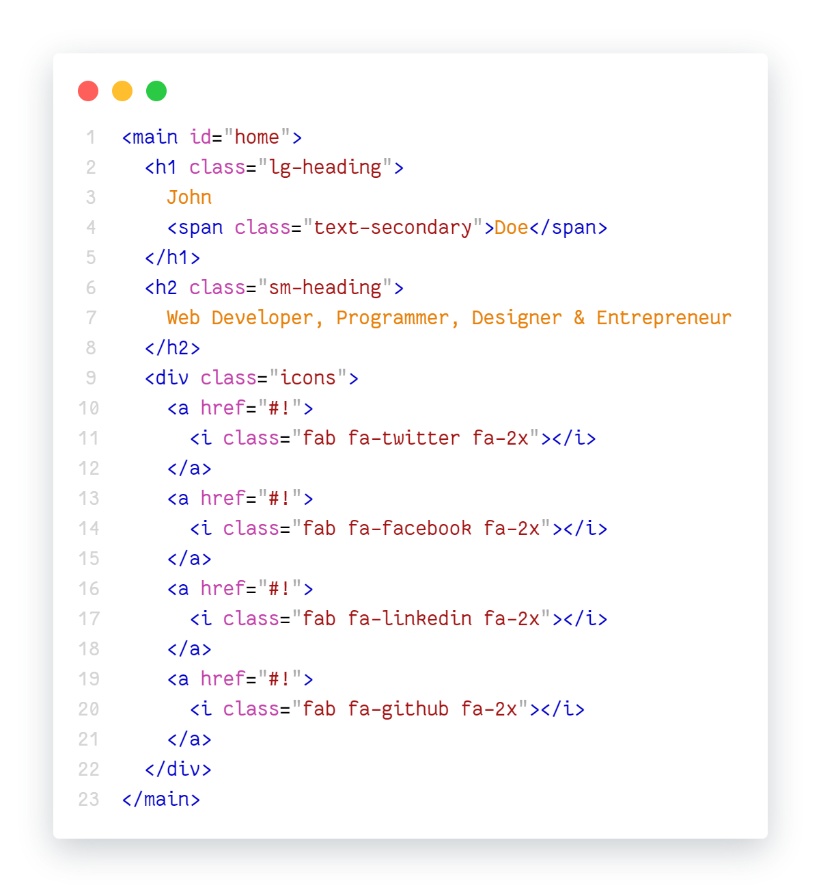
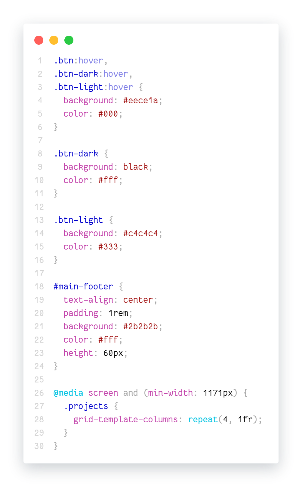

# RespectMyEyes-VSCode theme

Connect on Gitter:  
[](https://gitter.im/RespectMyEyes-VSCode/community)

A light theme focused on the frontend stack : **the TS/JS + React + HTML + CSS support**. 
Plus some other languages like **PowerShell, YAML, Markdown, AutoHotKey**.

*It can always be improved and some oddities can be fixed.*
<br/>
*The frontend-react-stack and some other languages are ready.*
<br/>
*Other languages need much work. Most of the not mentioned languages have no support at all.*
*Would be awesome if somebody worked on them.*

Please report any problems.

To use multiple themes for any configured file types, look at the [Theme by language](https://marketplace.visualstudio.com/items?itemName=jsaulou.theme-by-language) extension.


## Table of Contents

  - [Screenshots](#screenshots)
  - [Terminal looks](#terminal-looks)
  - [Supported languages](#supported-languages)
  - [Development instructions](#development-instructions)
  - [VS Code looks](#vs-code-looks)
  - [License](#license)


## Screenshots

<details>
  <summary>Big images</summary>
  
  <br />
  TypeScript:  
  
  <br />

  <br />
  
  <br />

  <br />
  
  <br />

  <br />
  Git:  
  
  <br />

  <br />
  JavaScript:  
  
  <br />
  Credit for the code: 
  <a href="https://github.com/bradtraversy/modern_portfolio">Brad Traversy</a>
  <br />

  <br />
  HTML:  
  
  <br />
  Credit for the code: 
  <a href="https://github.com/bradtraversy/modern_portfolio">Brad Traversy</a>
  <br />

  <br />
  CSS:  
  
  <br />
  Credit for the code: 
  <a href="https://github.com/bradtraversy/modern_portfolio">Brad Traversy</a>
  <br />

</details>


## Terminal looks

I would suggest to override the VS Code terminal defaults.

<details>
  <summary>settings.json</summary>

  <br />

  ```json5 
    // settings.json
    "workbench.colorCustomizations": {
        "[RespectMyEyes]": {
            "panel.background": "#f3f3f3",
            "terminal.ansiBlack": "#000000",
            "terminal.ansiBlue": "#3465A4",
            "terminal.ansiBrightBlack": "#555753",
            "terminal.ansiBrightBlue": "#729FCF",
            "terminal.ansiBrightCyan": "#34E2E2",
            "terminal.ansiBrightGreen": "#00D000",
            "terminal.ansiBrightMagenta": "#F066FF",
            "terminal.ansiBrightRed": "#EF2929",
            "terminal.ansiCyan": "#06989A",
            "terminal.ansiGreen": "#00B000",
            "terminal.ansiMagenta": "#AD7FA8",
            "terminal.ansiRed": "#CC0000",
            "terminal.ansiBrightWhite": "#A9A9A9",
            "terminal.ansiWhite": "#A9A9A9",
        }
    }
  ```
</details>


## Supported languages

<details>
  <summary>Supported languages table</summary>

  <br/>

**frontend-stack:**
<table>
  <thead>
    <tr>
      <th align="center">Language</th>
      <th align="center">Support</th>
      <th align="center">Grammar extention expected</th>
    </tr>
  </thead>
  <tbody>
    <tr>
      <td align="center">TypeScript / JavaScript</td>
      <td align="center">good</td>
      <td align="center">-</td>
    </tr>
    <tr>
      <td align="center">React</td>
      <td align="center">good</td>
      <td align="center">-</td>
    </tr>
    <tr>
      <td align="center">HTML</td>
      <td align="center">good</td>
      <td align="center">-</td>
    </tr>
    <tr>
      <td align="center">CSS</td>
      <td align="center">good</td>
      <td align="center">-</td>
    </tr>
    <tr>
      <td align="center">styled-components / CSS-in-JS</td>
      <td align="center">ok</td>
      <td align="center">
        <a href="styled-components">vscode-styled-components</a>
      </td>
    </tr>
    <tr>
      <td align="center">SASS</td>
      <td align="center">ok</td>
      <td align="center">-</td>
    </tr>
    <tr>
      <td align="center">Vue</td>
      <td align="center">weak</td>
      <td align="center">
        <a href="vue">Vue</a>
      </td>
    </tr>
    <tr>
      <td align="center">Angular</td>
      <td align="center">weak</td>
      <td align="center">-</td>
    </tr>
    <tr>
      <td align="center">LESS</td>
      <td align="center">weak</td>
      <td align="center">-</td>
    </tr>
  </tbody>
</table>

[vue]: https://marketplace.visualstudio.com/items?itemName=jcbuisson.vue
[styled-components]: https://marketplace.visualstudio.com/items?itemName=jpoissonnier.vscode-styled-components


**declarative files:**
<table>
  <thead>
    <tr>
      <th align="center">Language</th>
      <th align="center">Support</th>
      <th align="center">Grammar extention expected</th>
    </tr>
  </thead>
  <tbody>
    <tr>
      <td align="center">XML</td>
      <td align="center">good</td>
      <td align="center">-</td>
    </tr>
    <tr>
      <td align="center">JSON</td>
      <td align="center">good</td>
      <td align="center">-</td>
    </tr>
    <tr>
      <td align="center">YAML</td>
      <td align="center">ok</td>
      <td align="center">-</td>
    </tr>
    <tr>
      <td align="center">DotEnv</td>
      <td align="center">ok</td>
      <td align="center">
        <a href="dotenv">DotEnv</a>
      </td>
    </tr>
    <tr>
      <td align="center">Ignore</td>
      <td align="center">ok</td>
      <td align="center">-</td>
    </tr>
    <tr>
      <td align="center">Dockerfile</td>
      <td align="center">ok</td>
      <td align="center">-</td>
    </tr>
    <tr>
      <td align="center">Properties</td>
      <td align="center">weak</td>
      <td align="center">-</td>
    </tr>
  </tbody>
</table>

[dotenv]: https://marketplace.visualstudio.com/items?itemName=mikestead.dotenv


**other languages:**
<table>
  <thead>
    <tr>
      <th align="center">Language</th>
      <th align="center">Support</th>
      <th align="center">Grammar extention expected</th>
    </tr>
  </thead>
  <tbody>
    <tr>
      <td align="center">Markdown</td>
      <td align="center">good</td>
      <td align="center">
        <a href="markdown">Markdown All in One</a>
      </td>
    </tr>
    <tr>
      <td align="center">AutoHotKey</td>
      <td align="center">good</td>
      <td align="center">
        <a href="autohotkey">AutoHotKey</a>
      </td>
    </tr>
  </tbody>
</table>

[markdown]: https://marketplace.visualstudio.com/items?itemName=yzhang.markdown-all-in-one
[autohotkey]: https://marketplace.visualstudio.com/items?itemName=slevesque.vscode-autohotkey


**.NET stack:**
<table>
  <thead>
    <tr>
      <th align="center">Language</th>
      <th align="center">Support</th>
      <th align="center">Grammar extention expected</th>
    </tr>
  </thead>
  <tbody>
    <tr>
      <td align="center">PowerShell</td>
      <td align="center">ok</td>
      <td align="center">
        <a href="powershell">PowerShell</a>
      </td>
    </tr>
    <tr>
      <td align="center">C#</td>
      <td align="center">weak</td>
      <td align="center">
        <a href="csharp">C# Grammar Extended</a>
      </td>
    </tr>
  </tbody>
</table>

[csharp]: https://marketplace.visualstudio.com/items?itemName=dannymcgee.csharp-grammar-extended
[powershell]: https://marketplace.visualstudio.com/items?itemName=ms-vscode.PowerShell

</details>


## Development instructions

Press F5 to test the theme in a new debug window. Changes to the theme file are applied on save.  

`npm run build-and-install` packages the theme from your source code, and installs the local build into your VS Code. Requires the VS Code restart.


## VS Code looks

Interested how my VS Code looks? Here are the relevant parts of the `settings.json`.

<details>
  <summary>settings.json</summary>

  <br />

  ```json5
    // settings.json
    // UI Layout:
    "workbench.sideBar.location": "right",
    "workbench.activityBar.visible": true,
    "explorer.sortOrder": "default",
    "explorer.compactFolders": false,
    "window.zoomLevel": 0,
    "breadcrumbs.enabled": true,
    //
    //
    //
    // Editor UI:
    "editor.minimap.enabled": false,
    "editor.cursorSmoothCaretAnimation": true,
    "editor.renderWhitespace": "boundary",
    "editor.renderControlCharacters": false,
    "editor.renderIndentGuides": true,
    //
    //
    //
    // Font:
    "editor.fontFamily": "Fantasque Sans Mono",
    "editor.fontSize": 16,
    "editor.fontLigatures": true,
    "workbench.iconTheme": "vscode-icons",
    //
    //
    //
    // Show color for a code:   (Color-Highlight extension)
    "color-highlight.enable": true,
    "color-highlight.markerType": "dot-before",
    "color-highlight.markRuler": false,
    "editor.colorDecorators": false,
    //
    //
    //
    // Terminal window:
    "terminal.integrated.fontSize": 16,
    "terminal.integrated.cursorStyle": "underline",
    "terminal.integrated.cursorBlinking": true,
    //
    //
    //
    "files.associations": {
        ".stylelintrc": "json",
        ".stylelintignore": "ignore",
        ".eslintignore": "ignore",
        ".browserslistrc": "properties",
        ".prettierrc": "json"
    },
    //
    //
    //
    "workbench.colorTheme": "RespectMyEyes"
    //
    //
    //
    // customize the theme:
    "workbench.colorCustomizations": {
        "[RespectMyEyes]": {
            "panel.background": "#f3f3f3",
            "terminal.ansiBlack": "#000000",
            "terminal.ansiBlue": "#3465A4",
            "terminal.ansiBrightBlack": "#555753",
            "terminal.ansiBrightBlue": "#729FCF",
            "terminal.ansiBrightCyan": "#34E2E2",
            "terminal.ansiBrightGreen": "#00D000",
            "terminal.ansiBrightMagenta": "#F066FF",
            "terminal.ansiBrightRed": "#EF2929",
            "terminal.ansiCyan": "#06989A",
            "terminal.ansiGreen": "#00B000",
            "terminal.ansiMagenta": "#AD7FA8",
            "terminal.ansiRed": "#CC0000",
            "terminal.ansiBrightWhite": "#A9A9A9",
            "terminal.ansiWhite": "#A9A9A9",
        }
    }
  ```
</details>


## License

* **[MIT License](http://opensource.org/licenses/mit-license.php)**
* Copyright © 2021 <a href="https://github.com/dima-iholkin" target="_blank">Dima Iholkin</a>.